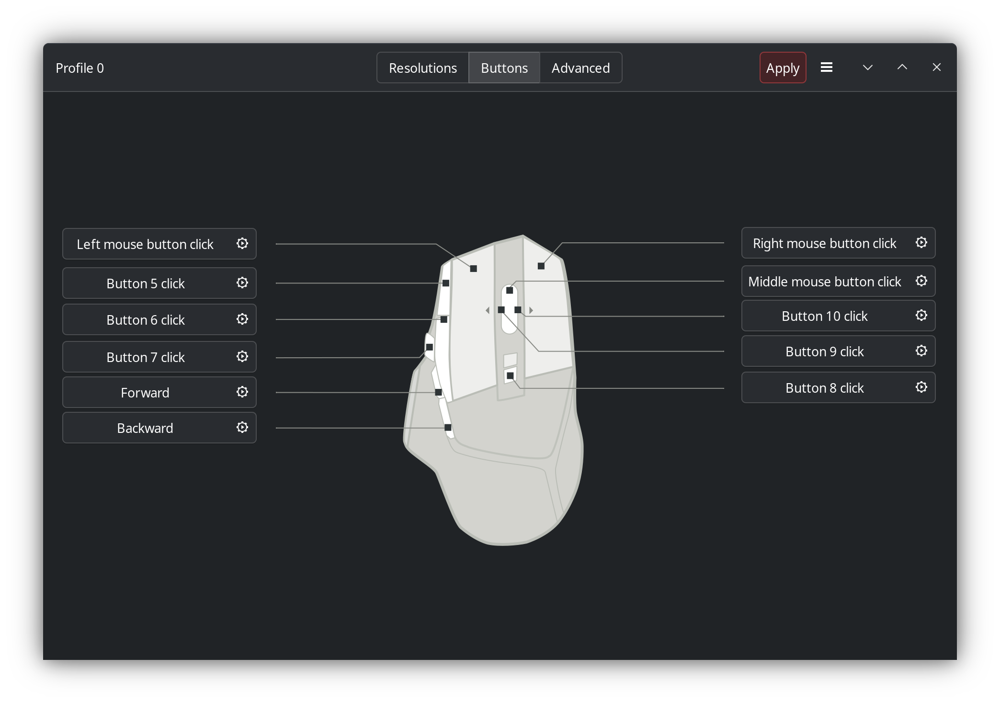

# Logitech G502 X Lightspeed

For logitech mice, it's important to make sure the buttons are not disabled, that they send *some* kind of information.
Example below is for a Logitech G502 X Lightspeed using the Piper Utility on Linux, note the buttons that say Button 5 Click to Button 10 Click, this ensures that MacroNova can read the button presses.

